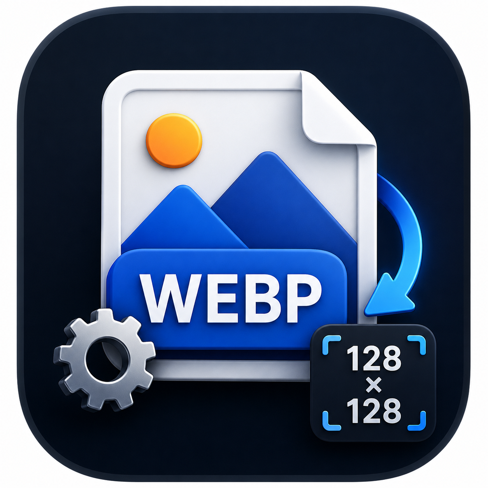

<div align="center">
  

  # WebP Forge

  **Conversão de imagens rápida, privada e preparada para grandes lotes.**

  Processe imagens no navegador ou utilize o aplicativo nativo para Windows.  
  Os arquivos permanecem no dispositivo e nunca são enviados para conversão.

  [Abrir versão web](https://webp-forge-web.arodzinskicb.workers.dev) ·
  [Microsoft Store](https://apps.microsoft.com/detail/9PB469QFGKR7) ·
  [Downloads](https://github.com/rodzinski/WebP-Forge/releases/latest) ·
  [Roadmap](https://webp-forge-web.arodzinskicb.workers.dev/roadmap) ·
  [Apoiar](https://github.com/sponsors/rodzinski)

  
  
  
  
  [](https://github.com/rodzinski/WebP-Forge/releases/latest)
</div>


## Visão geral

O WebP Forge é uma ferramenta gratuita para redimensionar, comprimir e converter imagens em lote. A versão web executa todo o processamento diretamente no navegador, enquanto o aplicativo Windows oferece uma experiência nativa, integração com o sistema e recursos avançados para fluxos locais.

O arquivo não é apenas renomeado: seus pixels são decodificados, redimensionados e codificados novamente no formato escolhido.

## Escolha sua experiência

| Recurso | Versão web | Aplicativo Windows |
| --- | :---: | :---: |
| Processamento local | ✓ | ✓ |
| Conversão em lote | ✓ | ✓ |
| WebP, AVIF, PNG, JPG e ICO | ✓ | ✓ |
| Instalação necessária | Não | Sim |
| Drag and drop | ✓ | ✓ |
| Histórico local | ✓ | ✓ |
| Exportação do histórico em PDF, XLSX e CSV | — | ✓ |
| Perfis personalizados | ✓ | ✓ |
| Integração “Abrir com” | — | ✓ |
| Distribuição pela Microsoft Store | — | ✓ |

> A disponibilidade de alguns formatos na web depende dos codecs implementados pelo navegador. Navegadores modernos baseados em Chromium oferecem a cobertura mais ampla.

## Principais recursos

- Conversão em lote para WebP, AVIF, PNG, JPG e ICO.
- Entrada em PNG, JPG, JPEG, JFIF, WebP, AVIF, GIF e BMP na web.
- Redimensionamento entre 1 × 1 e 4096 × 4096 pixels.
- Modos de ajuste para conter, recortar ou esticar.
- Qualidade configurável entre 1% e 100%.
- Comparação local antes/depois e estimativa de economia.
- Download individual ou de todo o lote em ZIP.
- Perfis personalizados armazenados localmente.
- Reordenação, cancelamento individual e repetição somente das falhas.
- Histórico, relatório detalhado por arquivo e exportação em PDF, XLSX e CSV no Windows.
- Web Worker, lista virtualizada e concorrência adaptativa para lotes grandes.
- Temas claro, escuro e automático.
- Interface em português, inglês e espanhol.
- Layout responsivo para desktop, tablet e celular.

## Privacidade por arquitetura

A conversão utiliza `createImageBitmap`, Canvas, Web Workers e outras APIs nativas do navegador. As imagens selecionadas:

- permanecem no dispositivo do usuário;
- não são enviadas ao Cloudflare ou a serviços externos;
- não são armazenadas em banco de dados;
- são descartadas ao fechar ou recarregar a página.

Somente preferências, perfis e histórico de conversão são armazenados localmente. O Cloudflare Web Analytics é carregado apenas após consentimento explícito e não recebe as imagens processadas.

Leia a [Política de Privacidade](https://webp-forge-web.arodzinskicb.workers.dev/privacy) para conhecer todos os detalhes.

## Como a conversão funciona

```text
Arquivo local
    ↓
Decodificação no navegador
    ↓
Redimensionamento e ajuste no canvas
    ↓
Codificação no formato selecionado
    ↓
Download local do resultado
```

1. O navegador decodifica a imagem selecionada.
2. A aplicação calcula as dimensões de acordo com o modo de ajuste.
3. A imagem é posicionada no canvas de destino.
4. O resultado é codificado novamente no formato e qualidade escolhidos.
5. O novo arquivo é disponibilizado para download.

## Arquitetura pública

```text
app/                     Rotas, páginas e layouts
components/
├── app/                 Experiência do conversor
├── landing/             Homepage e navegação pública
├── feedback/            Canal público de feedback
├── roadmap/             Roadmap visual
├── analytics/           Consentimento e preferências
└── ui/                  Componentes reutilizáveis
lib/                     Conversão, formatos, i18n e integrações
workers/                 Processamento de imagens fora da interface
tests/                   Testes automatizados de produto
worker/                  Entrada do Cloudflare Worker
public/                  Marca, manifesto e recursos estáticos
```

O código do aplicativo desktop é mantido separadamente. Este repositório contém a experiência web pública e os artefatos oficiais das versões Windows.

## Tecnologias

- React 19 e Next.js 15 App Router.
- TypeScript em modo estrito.
- Tailwind CSS.
- Framer Motion.
- Lucide Icons.
- `@jsquash/avif` para codificação AVIF compatível com o navegador.
- vinext e Cloudflare Workers.

As dependências de execução são compatíveis com Edge Runtime. A aplicação não utiliza `fs`, `net`, `child_process` ou outras APIs exclusivas do Node.js durante a execução no Cloudflare.

## Desenvolvimento local

### Requisitos

- Node.js 22.13 ou mais recente.
- npm 11.6.2.

### Instalação

```bash
git clone https://github.com/rodzinski/WebP-Forge.git
cd WebP-Forge
npm ci
npm run dev
```

Abra o endereço local exibido no terminal.

### Comandos disponíveis

| Comando | Descrição |
| --- | --- |
| `npm run dev` | Inicia o ambiente de desenvolvimento |
| `npm run lint` | Executa a análise estática |
| `npm run build` | Gera o build de produção |
| `npm test` | Compila e executa os testes automatizados |
| `npm run deploy:dry` | Valida o pacote do Cloudflare sem publicar |
| `npm run deploy` | Compila e publica manualmente no Cloudflare |

## Qualidade e publicação

Antes de enviar alterações:

```bash
npm run lint
npm test
```

O branch `main` é conectado ao Cloudflare Workers Builds:

| Configuração | Valor |
| --- | --- |
| Branch de produção | `main` |
| Comando de build | `npm run build` |
| Comando de deploy | `npx wrangler deploy --config dist/server/wrangler.json` |
| Diretório raiz | vazio |

Cada push para `main` inicia uma nova publicação automaticamente.

## Segurança

- Nenhuma credencial é necessária para executar o projeto localmente.
- Tokens de publicação devem permanecer exclusivamente nos secrets do Cloudflare ou GitHub.
- Nunca adicione certificados, chaves privadas, documentos pessoais ou arquivos `.env` ao repositório.
- Relate vulnerabilidades sem incluir dados pessoais, credenciais ou imagens privadas.

Para problemas comuns, utilize o [canal de feedback](https://webp-forge-web.arodzinskicb.workers.dev/feedback). Para uma possível vulnerabilidade, abra inicialmente uma discussão sem publicar detalhes exploráveis.

Contato oficial: [webpforge@gmail.com](mailto:webpforge@gmail.com).

## Produto e comunidade

- Consulte o [roadmap público](https://webp-forge-web.arodzinskicb.workers.dev/roadmap).
- Veja todas as mudanças no [changelog](https://webp-forge-web.arodzinskicb.workers.dev/changelog).
- Envie uma sugestão pelo [canal de feedback](https://webp-forge-web.arodzinskicb.workers.dev/feedback).
- Apoie a manutenção pelo [GitHub Sponsors](https://github.com/sponsors/rodzinski).
- Dê uma estrela no [repositório](https://github.com/rodzinski/WebP-Forge).

## Licença e reutilização

Este repositório não inclui atualmente uma licença de código aberto. A visibilidade pública do código não concede automaticamente permissão para copiar, redistribuir ou criar trabalhos derivados. Consulte o proprietário antes de reutilizar o projeto fora dos limites permitidos pela legislação aplicável.

---

<div align="center">
  Desenvolvido com foco em velocidade, privacidade e uma experiência simples.
</div>
