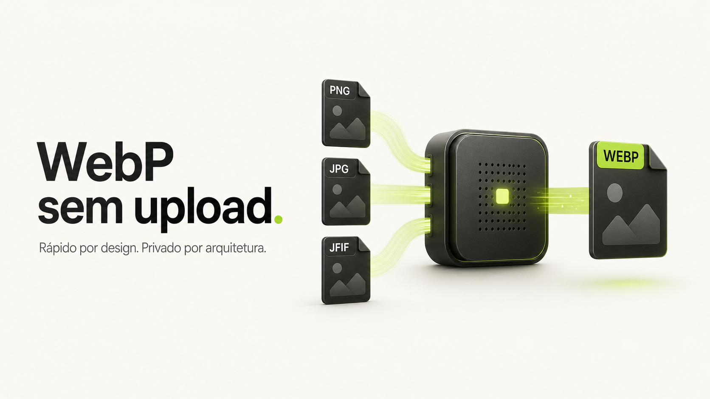

# WebP Forge



Conversor de imagens em lote gratuito e executado diretamente no navegador. Redimensione, comprima e baixe imagens sem enviar os arquivos para um servidor.

## Acesse o WebP Forge

Use a versão pública em:

**[Abrir WebP Forge](https://webp-forge-web.arodzinskicb.workers.dev)**

## Principais recursos

- Conversão em lote para WebP, AVIF, PNG, JPG e ICO.
- Entrada em PNG, JPG, JPEG, JFIF, WebP, AVIF, GIF e BMP.
- Redimensionamento entre 1 × 1 e 4096 × 4096 pixels.
- Proporção original preservada, sem distorção.
- Imagem centralizada com transparência nas áreas restantes.
- Qualidade configurável entre 1% e 100%.
- Download individual ou de todo o lote em ZIP.
- Comparação local antes/depois, com tamanho final e estimativa de economia.
- Remoção automática de EXIF, localização e outros metadados no navegador.
- Detecção de GIF/WebP animado com aviso explícito de exportação pelo primeiro quadro na versão web.
- Perfis personalizados salvos localmente no navegador.
- Reordenação do lote e cancelamento individual de itens.
- Relatório detalhado por arquivo com repetição somente das falhas.
- Histórico local de conversões com detalhes dos últimos lotes.
- Atalhos de teclado para seleção, conversão, configurações e histórico.
- Interface do conversor em português, inglês e espanhol.
- Processamento em Web Worker para manter a interface responsiva em lotes grandes.
- Lista virtualizada para navegar por milhares de arquivos com baixo custo de renderização.
- Concorrência adaptativa baseada nos núcleos, memória e perfil de interação do dispositivo.
- Drag and drop de múltiplos arquivos.
- Temas claro, escuro e automático.
- Interface responsiva para desktop, tablet e celular.

## Privacidade

A conversão utiliza `createImageBitmap`, Canvas e outras APIs nativas do navegador. As imagens selecionadas:

- permanecem no dispositivo do usuário;
- não são enviadas ao Cloudflare ou a serviços externos;
- não são armazenadas em banco de dados;
- são descartadas ao fechar ou recarregar a página.

Somente preferências de conversão e tema são salvas localmente no navegador.

## Como a conversão funciona

1. O navegador decodifica a imagem selecionada.
2. A aplicação calcula o maior tamanho que cabe no canvas de destino, mantendo a proporção.
3. A imagem é centralizada sobre um canvas transparente.
4. O canvas é codificado no formato e na qualidade escolhidos.
5. O resultado é disponibilizado para download como `.webp` ou em um arquivo ZIP.

O arquivo não é apenas renomeado: seus pixels são decodificados, redimensionados e codificados novamente no formato selecionado.

## Tecnologias

- React 19
- Next.js 15 App Router
- TypeScript em modo estrito
- Tailwind CSS
- Framer Motion
- Radix UI
- Lucide Icons
- vinext e Cloudflare Workers

Todas as dependências de execução são compatíveis com o ambiente do Cloudflare Workers. A lógica de conversão utiliza Web APIs no cliente.

## Executando localmente

### Requisitos

- Node.js 22.13 ou mais recente
- npm 10 ou mais recente

### Instalação

```bash
git clone https://github.com/rodzinski/WebP-Forge.git
cd WebP-Forge
npm ci
npm run dev
```

Abra o endereço local exibido no terminal.

## Comandos disponíveis

| Comando | Descrição |
| --- | --- |
| `npm run dev` | Inicia o ambiente de desenvolvimento |
| `npm run lint` | Executa a análise estática do código |
| `npm run build` | Gera o build de produção |
| `npm test` | Compila e executa os testes automatizados |
| `npm run deploy:dry` | Simula o pacote que será enviado ao Cloudflare |
| `npm run deploy` | Compila e publica manualmente no Cloudflare |

## Estrutura do projeto

```text
app/
├── app/                  Conversor de imagens
├── layout.tsx            Layout e metadados globais
└── page.tsx              Homepage
components/
├── landing/              Seções da homepage
├── motion/               Componentes de animação
└── ui/                   Componentes reutilizáveis
lib/                      Utilitários compartilhados
public/                   Ícones, manifesto e imagens públicas
tests/                    Testes automatizados
worker/                   Entrada do Cloudflare Worker
```

## Publicação no Cloudflare

O repositório pode ser conectado diretamente ao Cloudflare Workers Builds.

| Configuração | Valor |
| --- | --- |
| Branch de produção | `main` |
| Comando de build | `npm run build` |
| Comando de deploy | `npx wrangler deploy --config dist/server/wrangler.json` |
| Diretório raiz | vazio |

Cada push para `main` inicia uma nova publicação automaticamente.

## Compatibilidade

A disponibilidade de formatos de entrada depende dos codecs suportados pelo navegador. Navegadores modernos baseados em Chromium oferecem a cobertura mais ampla. GIFs animados são convertidos como uma imagem estática.

## Segurança

Nenhuma credencial é necessária para executar o projeto localmente. Tokens do Cloudflare usados em publicação automatizada devem ser configurados exclusivamente como secrets no painel da plataforma e nunca adicionados ao repositório.

## Licença

Este repositório não inclui uma licença de código aberto. Consulte o proprietário antes de copiar, redistribuir ou reutilizar o código fora dos limites permitidos pela legislação aplicável.
